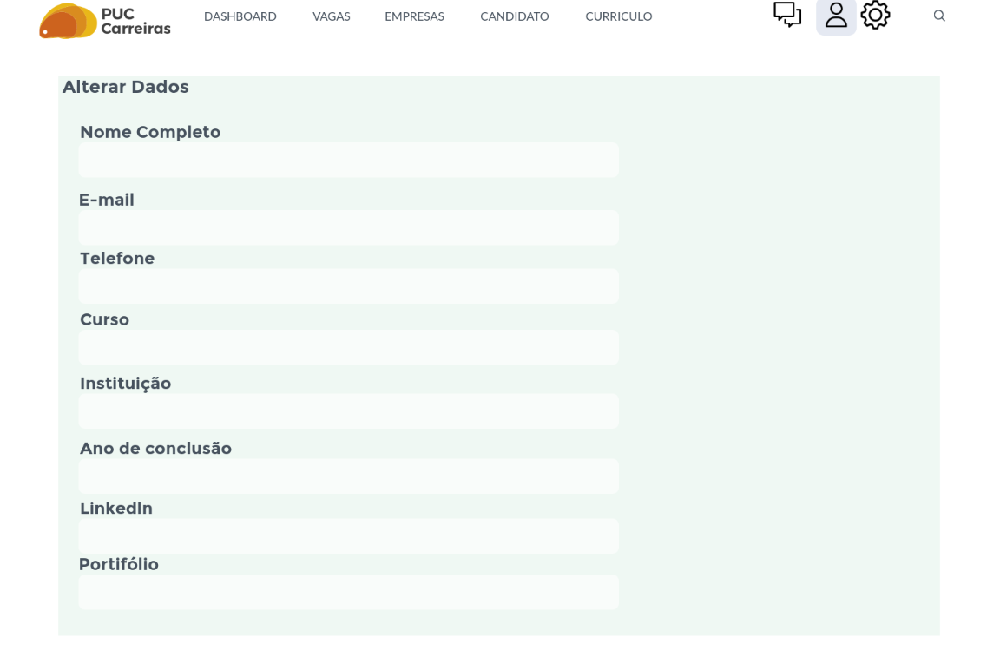

# Projeto de Interface

## User Flow

Fluxo de usuário (User Flow) é uma técnica que permite ao desenvolvedor mapear todo fluxo de navegação do usuário na aplicação. Essa técnica funciona para alinhar os caminhos e as possíveis ações que o usuário pode fazer junto com os membros de sua equipe.

<figure>
 
 
 
</figure>
<!--
> **Links Úteis**:
> - [User Flow: O Quê É e Como Fazer?](https://medium.com/7bits/fluxo-de-usu%C3%A1rio-user-flow-o-que-%C3%A9-como-fazer-79d965872534)
> - [User Flow vs Site Maps](http://designr.com.br/sitemap-e-user-flow-quais-as-diferencas-e-quando-usar-cada-um/)
> - [Top 25 User Flow Tools & Templates for Smooth](https://www.mockplus.com/blog/post/user-flow-tools)
-->
<!--
## Protótipo
Desenvolver um protótipo emerge como uma das maneiras mais ágeis e econômicas de validar uma ideia, conceito ou funcionalidade. Isso permite a interação, avaliação, modificação e aprovação das principais características de uma interface antes de entrar na fase de desenvolvimento. Leia o artigo [Protótipos: baixa, média ou alta fidelidade?](https://medium.com/ladies-that-ux-br/prot%C3%B3tipos-baixa-m%C3%A9dia-ou-alta-fidelidade-71d897559135).-->

### Protótipo de baixa fidelidade

Protótipos de baixa fidelidade apresentam de forma simplificada o design da interface e o relacionamento entre suas páginas, permitindo evolução da proposta da solução. Neste projeto, os utilizaremos para apoiar a validação dos requisitos e efetuar mudanças dos mesmos, caso seja necessário, para menor impacto na codificação da aplicação.

 <section >
  

    <h3>00_Tela de login</h3>
    
Tela de login com campos de usuario e senha

      <figure>
        
      </figure>
  

  

  

    <h3>01_Tela de cadastro</h3>
    
Tela de cadastro para acessar o sistema

      <figure>
        
      </figure>
  

  

  

    <h3>02_Tela de cadastro de vaga</h3>
    
Tela de cadastro de vagas

      <figure>
        
      </figure>
  

  

  

    <h3>03_Dashboard</h3>
    
Dashboard com informações gerais sobre vagas, empresas e candidatos

      <figure>
        
      </figure>
  

  

  

    <h3>04_Tela de vagas disponíveis no sistema</h3>
    
Tela com informações sobre as vagas disponíveis

      <figure>
        
      </figure>
  

  

  

    <h3>05_Tela com as informações das empresas contratantes</h3>
    
Informações sobre a empresa e detalhes sobre a vaga

      <figure>
        
      </figure>
  

  

  

    <h3>06_Tela com as informações dos candidatos</h3>
    
Informações sobre os candidatos inscritos

      <figure>
        
      </figure>
  

  

  

    <h3>07_Tela de currículo de candidatos</h3>
    
Tela para os candidatos editar dados do currículo

      <figure>
        
      </figure>
  

  

  

    <h3>08_Tela do chat interno do sistema</h3>
    
Chat de comunicação entre candidato e empresa

      <figure>
        
      </figure>
  

  

   

    <h3>09_Tela de perfil de usuário (candidato)</h3>
    
Tela para alterar e adicionar dados sobre o perfil 

      <figure>
        
      </figure>
  

  

   

    <h3>10_Tela de configurações gerais do sistema </h3>
    
Tela com ajustes e preferências do candidato 

      <figure>
        
      </figure>
  

  

   

    <h3>11_Tela de barra de filtragem </h3>
    
Barra de filtragem de vagas e localização

      <figure>
        
      </figure>
  

  

  
 </section>
 <!--
[Elabore as principais interfaces gráficas da aplicação de modo que os requisitos funcionais sejam contemplados nas telas propostas.]

 [Adicione aqui as telas da sua aplicação com seus devidos títulos.] 
 
 > **Links Úteis**:
 > - [Protótipos vs Wireframes](https://www.nngroup.com/videos/prototypes-vs-wireframes-ux-projects/)
 >- Ferramentas:
 >> - [Pencil](https://pencil.evolus.vn/)
 >> - [MarvelApp](https://marvelapp.com/)
 >> - [Figma](https://www.figma.com/)
-->

