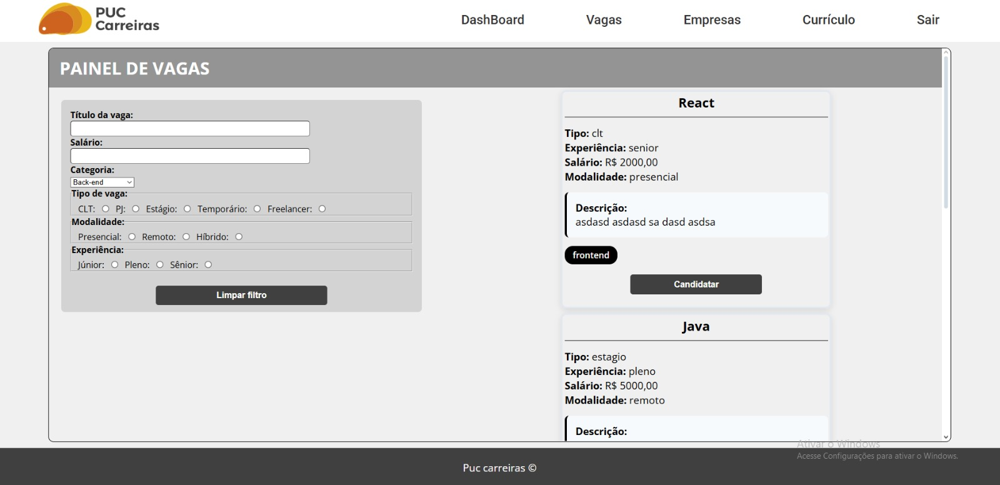

# Template padrão da Aplicação

Layout padrão do site (HTML e CSS) que será utilizado em todas as páginas com a definição de identidade visual, aspectos de responsividade e iconografia.

<h4>Número de cores</h4>

A aplicação utiliza a seguinte paleta de cores:

<ul>
  <li>#40404</li>
  <li>#e9b719</li>
  <li>#f0f0f0</li>
</ul>
<h3> Tipografia de fontes</h3>

  Utilizado o Google Fonts para estilizar a fonte do texto.

<ul>
  <li>Roboto</li>
  <li>Open Sans</li>
</ul>
<h3>Template da aplicacao</h3>

<h4>Dashboard</h4>
<figure>
  
</figure>

<h4>Vagas</h4>
<figure>
   
</figure>

<h4>Empresas</h4>
<figure>
   
</figure>

<h4>Currículo</h4>
<figure>
   
</figure>

<!--
> **Links Úteis**:
>
> - [CSS Website Layout (W3Schools)](https://www.w3schools.com/css/css_website_layout.asp)
> - [Website Page Layouts](http://www.cellbiol.com/bioinformatics_web_development/chapter-3-your-first-web-page-learning-html-and-css/website-page-layouts/)
> - [Perfect Liquid Layout](https://matthewjamestaylor.com/perfect-liquid-layouts)
> - [How and Why Icons Improve Your Web Design](https://usabilla.com/blog/how-and-why-icons-improve-you-web-design/)
-->
