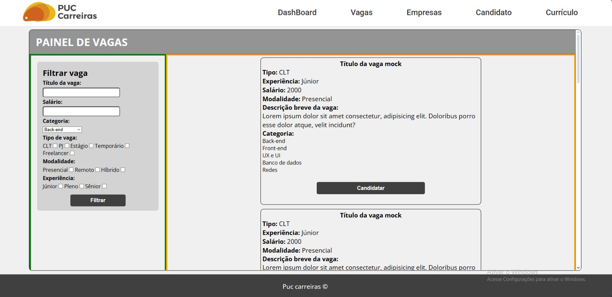
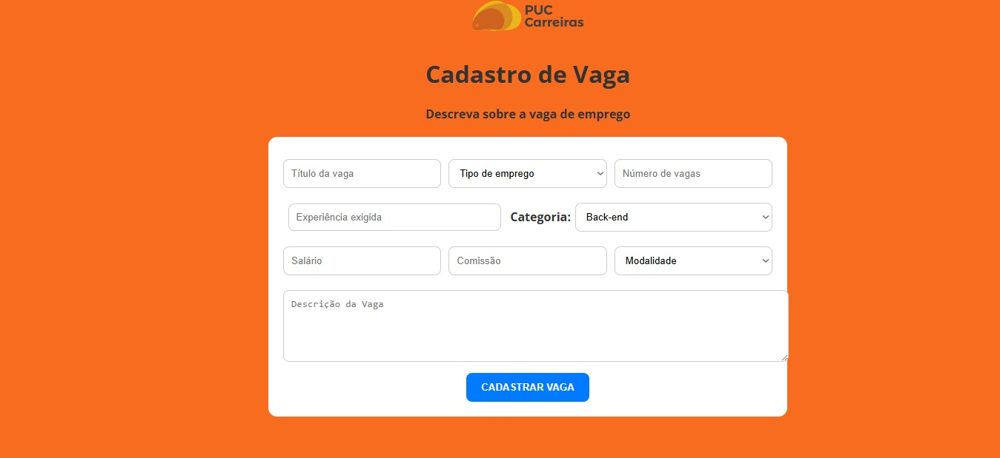
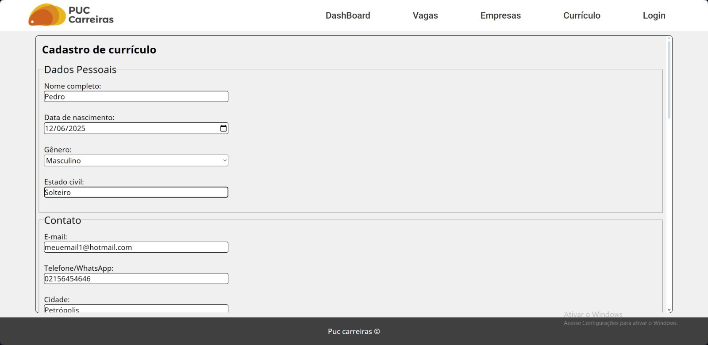

# Programação de Funcionalidades

Implementação da aplicação descritas por meio dos requisitos codificados. 

[Utilize a estrutura abaixo para cada funcionalidade entregue na etapa]

<h3>Tela de cadastro</h3>

<figure>
  
</figure>

#### Requisito atendido

  RF-01: Tela de login com os campos de usuário e senha;

#### Artefatos da funcionalidade

<!--[Adicione os nomes dos arquivos relacionados ao desenvolvimento da funcionalidade]-->
<ul>
  <li>index.html</li>
  <li>login.js</li>
</ul>

<!--
#### Estrutura de Dados

[Caso exista estrutura de dados, adicione aqui]

#### Instruções de acesso

[Adicione as orientações de acesso à funcionalidade]

-->
#### Responsável

Welinton Reis

<h3>Tela de vagas</h3>

<figure>
  
</figure>

#### Requisito atendido

  RF-02 e RF-06: página de vagas com filtro e cards;

#### Artefatos da funcionalidade

<!--[Adicione os nomes dos arquivos relacionados ao desenvolvimento da funcionalidade]-->
<ul>
  <li>cadastro_vaga.html</li>
  <li>index.html</li>
  <li>vagas.html</li>
  <li>vagas.js</li>
</ul>

<!--
#### Estrutura de Dados

[Caso exista estrutura de dados, adicione aqui]

#### Instruções de acesso

[Adicione as orientações de acesso à funcionalidade]

-->
#### Responsável

Pedro Henrique de Azevedo

<h3>Cadastro de vagas</h3>

<figure>
  
</figure>

#### Requisito atendido

  RF-08: página para cadastro de vagas;

#### Artefatos da funcionalidade

<!--[Adicione os nomes dos arquivos relacionados ao desenvolvimento da funcionalidade]-->
<ul>
  <li>cadastro_vaga.html</li>
  <li>index.html</li>
  <li>vagas.html</li>
  <li>vagas.js</li>
</ul>

<!--
#### Estrutura de Dados

[Caso exista estrutura de dados, adicione aqui]

#### Instruções de acesso

[Adicione as orientações de acesso à funcionalidade]

-->
#### Responsável

Edilson Martins

<h3>Página de currículo</h3>

<figure>
  
</figure>

#### Requisito atendido

  RF-04: enviar documentos para a página web;

#### Artefatos da funcionalidade

<!--[Adicione os nomes dos arquivos relacionados ao desenvolvimento da funcionalidade]-->
<ul>
  <li>curriculo.html</li>
</ul>

<!--
#### Estrutura de Dados

[Caso exista estrutura de dados, adicione aqui]

#### Instruções de acesso

[Adicione as orientações de acesso à funcionalidade]

-->
#### Responsável

Pedro Henrique de Azevedo

<!--
> **Links Úteis**:
> - [Trabalhando com HTML5 Local Storage e JSON](https://www.devmedia.com.br/trabalhando-com-html5-local-storage-e-json/29045)
> - [JSON Tutorial](https://www.w3resource.com/JSON)
> - [JSON - Introduction (W3Schools)](https://www.w3schools.com/js/js_json_intro.asp)
> - [JSON Tutorial (TutorialsPoint)](https://www.tutorialspoint.com/json/index.htm)

-->
